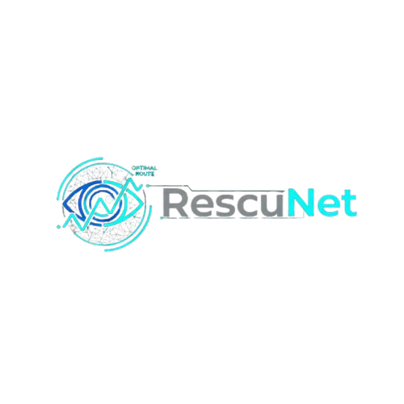
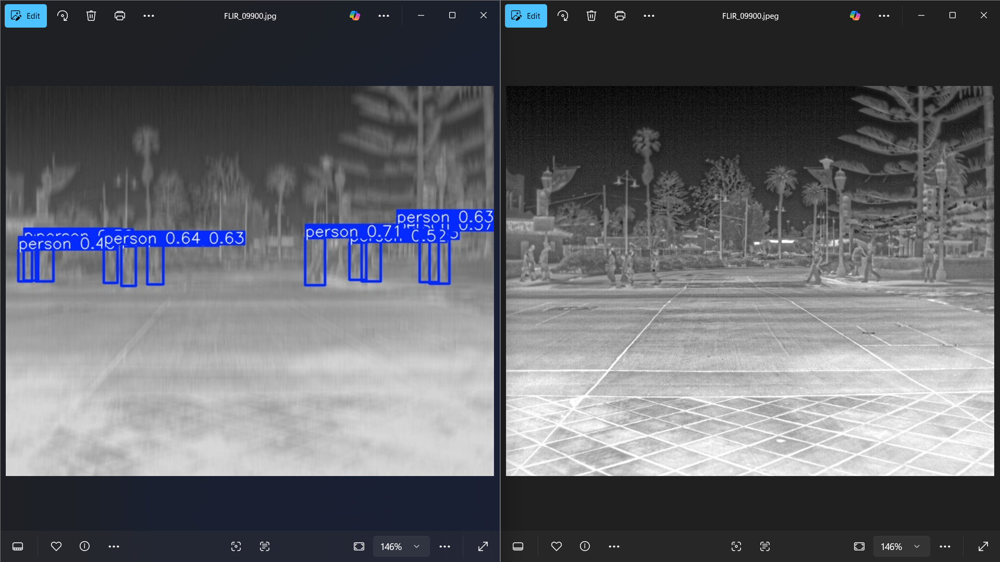
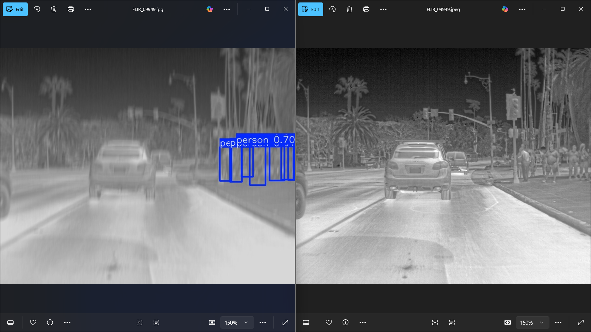

# **RescuNet**

<div align="center" style="padding: 0; margin: 0;">
  
  <p><b>Next-Gen Disaster Response Intelligence</b></p>
</div>

---

RescuNet is an AI-powered platform designed to **transform disaster response operations**.
By combining **aerial computer vision**, **graph-based rescue route optimization**, and **real-time text intelligence**, RescuNet helps emergency teams:

* Detect survivors
* Identify fire/smoke hazards
* Track vehicles and obstacles
* Navigate complex disaster zones
* Make fast, data-driven decisions

---

# 📸 RescuNet Computer Vision Module

The Computer Vision module provides real-time intelligence using **RGB** and **Thermal** drone footage, powered by custom-trained **YOLOv11** models.

> **Team Contribution:**
>
> * **Maher** developed and trained the **Fire & Smoke Detection Model** (YOLOv11m).
> * **Amr Hassan** developed the **RGB People & Car Detection Models**, and **Thermal Person Detection Model**.

---

## 🚁 Aerial Intelligence Features

### 🔍 Real-Time Detection

Runs YOLOv11 models for detecting:

* People / Survivors
* Fire
* Smoke
* Cars
* Heat signatures (Thermal)

---

## Dual-Mode Surveillance

---

## **1. RGB Mode**

RGB mode handles visible-spectrum hazards and object detection.

### **Models Used**

| Feature      | Model        | Contributor | Reason                                |
| ------------ | ------------ | ----------- | ------------------------------------- |
| Smoke & Fire | **YOLOv11m** | **Maher**   | Handles complex patterns & occlusions |
| Cars         | **YOLOv11s** | Amr         | Lightweight + real-time speed         |
| People       | **YOLOv11s** | Amr         | High FPS requirement                  |

---

## **2. Thermal Mode**

Optimized for detecting people through smoke, fog, and darkness.

| Feature          | Model        | Contributor | Reason                                   |
| ---------------- | ------------ | ----------- | ---------------------------------------- |
| Person Detection | **YOLOv11s** | Amr         | Lightweight & fast for onboard inference |

---

# 📂 Project File Structure

```
RescuNet/
│
├── RGB_model/
│
├── Test/
│   ├── RGB/
│   │
│   └── thermal/
│
├── models/
│
├── thermal_model/
│
├── LICENSE
└── README.md
```

---

# 🖼️ Visual Results

Below are sample outputs generated by the RescuNet Computer Vision models.

### **Fire & Smoke Detection (Maher’s Model)**

<div align="center">
  
  
</div>

---

### **People Detection (RGB)**

<div align="center">
  
  
</div>

---

### **Car Detection (RGB)**

<div align="center">
  
  
</div>

---

### **Thermal Survivor Detection**

<div align="center">
  
  
</div>

---

# 📄 License

Licensed under the **MIT License**.

---
